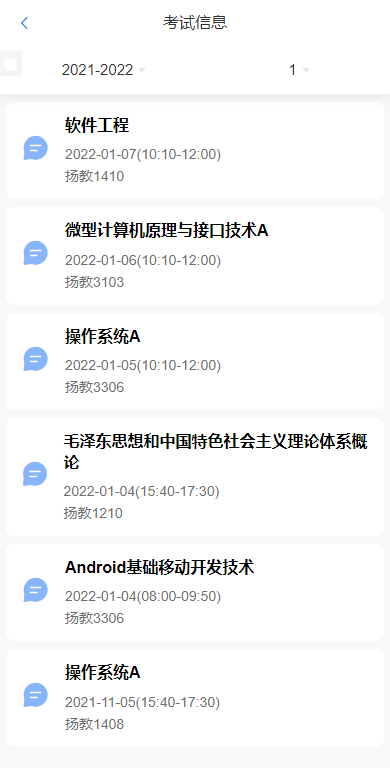

# 简介

基于SpringBoot和Vue的信息展示系统。数据来源于对学校教务系统以及一卡通系统爬虫。

后台管理系统基于vuestic-ui模版进行修改

项目实现一个基于PWA技术的全平台Web应用系统。系统目标是设计并实现一个智慧校园系统。提供一系列方便学生的功能。同时系统内的订阅系统加强了教师与学生、社团与成员或其他组织与参与者的沟通。接入PWA技术的Web系统不仅拥有Web系统原本快速启动随时使用的优点，还拥有了像原生应用一样的使用体验。同时，该项目还提供了后台管理系统，方便管理员管理。

项目中应用的关键技术：Html，css，JavaScript，Vue，Element-UI，Java，SpringBoot，Shiro，Nginx。

主要功能：

- 教务系统包括包括查询课表、查询成绩、查询考试信息、查询停调课通知、修改教务系统密码；

- 一卡通系统包括查询宿舍电费、校园卡流水信息、校园卡挂失/解挂、校园卡充值、宿舍购电；

- 订阅系统包括创建频道、订阅频道、频道管理、解散频道等功能；

- 后台管理系统包括横幅管理，用户权限管理。

# 特色与创新点

- 采用B/S架构，使用Web系统形式作为最终产品。使用方便、快速、无需占用终端额外空间。

- 加强了教师与学生、社团与成员或其他组织与参与者的沟通。

- 快速信息查询，无需前往多个平台分开登录账号查询。

- 拥有独立的后台管理系统，可以快速地对本项目的各种用户权限、横幅通知进行管理。

本项目接入了PWA技术，PWA技术使得本系统拥有像原生应用一样的通知、本地缓存等功能，使用体验上更加良好。

# 项目截图

## 移动端

图1：移动端主页，可以通过教务系统账号密码进行登录：

图1.移动端主页

图2.移动端首页，提供一系列功能按钮以及部分信息。同时可在右上角信箱图标进入订阅系统。

图2.移动端首页

图3、4、5：基础功能演示：

 

 
图3.课表

图4.成绩信息 

图5.考试信息 

图6：一卡通系统登录：

图6.一卡通系统登录 

图7：一卡通系统首页，图8、9、10、11：一卡通系统功能演示，

图7.一卡通系统首页 

图8.校园卡充值

图9.校园卡挂失

图10.宿舍购电

图11.一卡通查询密码修改

图12：订阅系统首页

图12.订阅系统首页

图13：进行频道创建

图13.创建频道

图14：查看频道历史消息

图14.频道历史消息

图15：对频道进行管理

图15.频道管理

## PC端

PC端与移动端功能基本相同，不再演示具体页面，只展示登录页面与首页。

 

图16.PC端登录页面

图17.PC端首页

## 后台管理系统

图18.后台管理系统登录页面

图19.移动端首页横幅管理

图20.管理员账号管理界面

图21.用户频道权限管理页面

